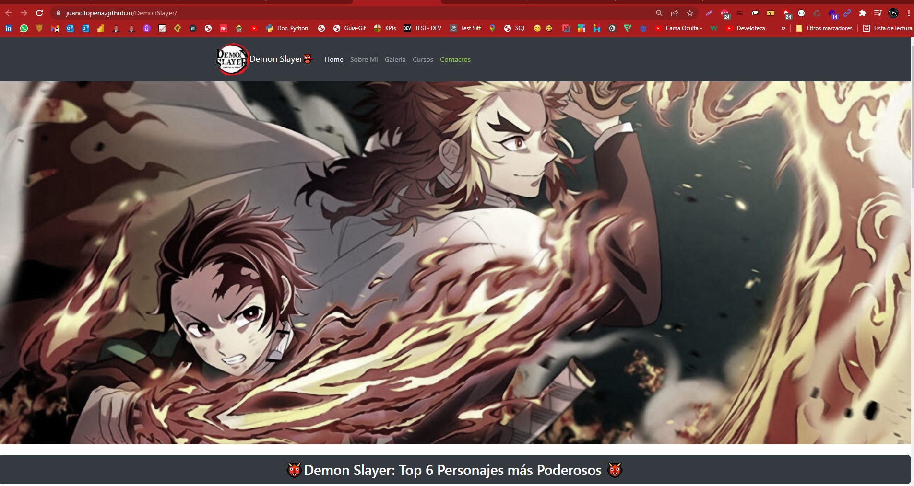
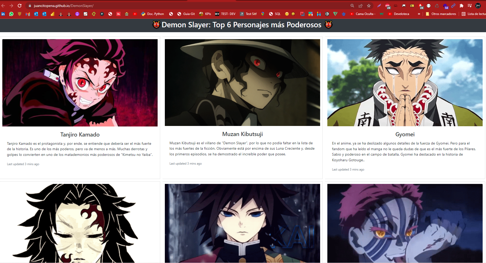

# DemonSlayer
## Pagina DemonSlayer utilizando HTML, CSS y Bootstrap

"## 😀 Creacion de Interface y diseños UX-UI, con HTML, CSS, Bootstrap, Para Presentar Sitio Web DemonSlayer.

### TECNOLOGIAS UTILIZADAS:

* HTML5
* CSS3
* BOOTSTRAP 5
+ Font Awesome
+ GitHub

## Captura # 1:

## Captura # 2:

## Captura # 3:

## Captura # 4:

" URL al Proyecto: https://juancitopena.github.io/DemonSlayer/"
